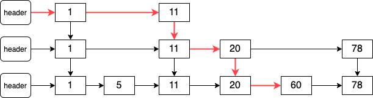
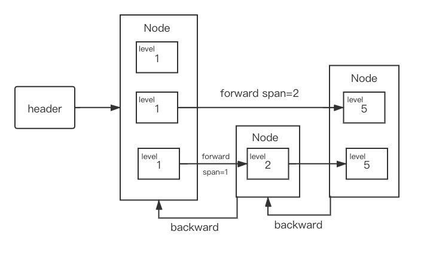

本项目完整地址 [simple-redis](https://github.com/dawnzzz/simple-redis)

# List

Godis 中定义了 List 接口，以定义 List 的各种操作。

```go
// Expected check whether given item is equals to expected value
type Expected func(a interface{}) bool

// Consumer traverses list.
// It receives index and value as params, returns true to continue traversal, while returns false to break
type Consumer func(i int, v interface{}) bool

type List interface {
   Add(val interface{})
   Get(index int) (val interface{})
   Set(index int, val interface{})
   Insert(index int, val interface{})
   Remove(index int) (val interface{})
   RemoveLast() (val interface{})
   RemoveAllByVal(expected Expected) int
   RemoveByVal(expected Expected, count int) int
   ReverseRemoveByVal(expected Expected, count int) int
   Len() int
   ForEach(consumer Consumer)
   Contains(expected Expected) bool
   Range(start int, stop int) []interface{}
}
```

## 数据结构

### 快速链表

在 godis 中，采用**快速链表**作为 List 的数据结构。

快速链表实际上就是一个**双向链表**，但是双向链表中的每一个节点不是存储一个数据，而是**将数据连续存放形成一段连续的存储空间**作为链表的节点。

这一段连续的存储空间在 godis 中被称为 page（每一个 page 的大小为 1024），page 的类型为**空接口切片**。

```go
// pageSize must be even
const pageSize = 1024

// QuickList is a linked list of page (which type is []interface{})
// QuickList has better performance than LinkedList of Add, Range and memory usage
type QuickList struct {
   data *list.List // list of []interface{}
   size int
}
```

### 迭代器

又定义了 iterator 为快速链表的迭代器，在 `[-1, QuickList.Len()]` 范围内移动。

- node 表示元素所在的 page。
- offset 表示这个元素在 page 中的下标。

```go
// iterator of QuickList, move between [-1, ql.Len()]
type iterator struct {
   node   *list.Element
   offset int
   ql     *QuickList
}
```

下面以 QuickList.find 方法、iterator.get 方法、iterator.next 方法为例说明迭代器的实现。

#### find 查找 index 对应的迭代器

比如 QuckList 定义了一个方法 find，用于**查找对应 index 的迭代器**。

```go
// find returns page and in-page-offset of given index
func (ql *QuickList) find(index int) *iterator
```

其流程为：

- 首先查看 index 在快速链表的前半部分还是后半部分。**若在前半部分，则从前向后查找**。
  - 从前向后查找，找到 index 所在的 page，pageBeg 表示这个 index 所在 page 之前的元素个数。

```go
/ 首先查看 index 在快速链表的前半部分还是后半部分。
if index < ql.size/2 {
   // 若在前半部分，则从前向后查找
   node = ql.data.Front()
   pageBeg = 0
   for {
      page := node.Value.([]interface{})
      if pageBeg+len(page) > index {
         break
      }

      pageBeg += len(page)
      node = node.Next()
   }
}
```

- **若 index 在快速链表的后半部分，则从后向前查找**。

```go
else {
   // 后半部分，从后向前查找
   node = ql.data.Back()
   pageBeg = ql.size
   for {
      page := node.Value.([]interface{})
      if pageBeg-len(page) <= index {
         pageBeg -= len(page)
         break
      }

      pageBeg -= len(page)
      node = node.Prev()
   }
}
```

- 计算这个 index 在 page 中的相对位置 offset，返回迭代器。

```go
// 计算这个 index 在 page 中的相对位置 offset，返回迭代器。
pageOffset := index - pageBeg
return &iterator{
   node:   node,
   offset: pageOffset,
   ql:     ql,
}
```

#### get 获取迭代器所指向的数据

interator.get 方法用于获取迭代器所执行的数据：

- 它首先调用 iterator.page 方法获取所在 page（类型为空接口切片）。
- 接着获取 page 中 offset 下标中的数据内容。

```go
func (iter *iterator) get() interface{} {
   return iter.page()[iter.offset]
}

func (iter *iterator) page() []interface{} {
   return iter.node.Value.([]interface{})
}
```

#### next 移动到下一个数据元素

iterator.nex 方法将迭代器移动到下一个元素上。

```go
func (iter *iterator) next() bool
```

其流程为：

- 首先获取所在 page，若当前迭代器的元素不是 page 的最后一个元素，直接 offset + 1即可返回。

```go
// 首先获取所在 page，若当前迭代器的元素不是 page 的最后一个元素，直接 offset + 1即可返回。
page := iter.page()
if iter.offset < len(page)-1 {
   iter.offset += 1
   return true
}
```

- 否则则移动到下一个 page 上：
  - 移动之前首先看看当前 page 是不是最后一个 page，若是则说明迭代器当前指向的元素是整个快速链表的最后一个元素。此时将迭代器移动到 `QuickList.Len()` 位置上。
  - 不是最后一个 page，就移动到下一个 page 的第一个数据上。

```go
// 是page的最后一个元素，则移动到下一个 page 上
// 移动之前首先看看当前 page 是不是最后一个 page，若是则说明迭代器当前指向的元素是整个快速链表的最后一个元素。此时将迭代器移动到 ql.Len() 位置上。
if iter.node == iter.ql.data.Back() {
   iter.offset = len(page)
   return false
}
// 不是最后一个 page，就移动到下一个 page 的第一个数据上。
iter.node = iter.node.Next()
iter.offset = 0
```

## Get Set 查询、更新数据

在快速链表上查询数据非常简单，首先获取 index 所在的迭代器，然后调用 iterator.get 方法获取其指向的值。

```go
func (ql *QuickList) Get(index int) (val interface{}) {
	iter := ql.find(index)

	return iter.get()
}
```

在快速链表上更新数据也是同样的，首先获取 index 所在的迭代器，接着调用 iterator.set 方法更改其值。

```go
func (ql *QuickList) Set(index int, val interface{}) {
	if index < 0 || index >= ql.size {
		panic("`index` out of range")
	}

	iter := ql.find(index)
	iter.set(val)
}
```

## Add 在尾部插入数据

Add 用于在快速链表的尾部插入数据。

```go
func (ql *QuickList) Add(val interface{})
```

流程如下：

- 首先检查**是否是空链表**，若是空链表则初始化一个链表插入到第一个位置上。

```go
ql.size++
if ql.data.Len() == 0 {
   // list 为空，插入一个page
   page := make([]interface{}, 0, pageSize)
   page = append(page, val)
   ql.data.PushBack(page)

   return
}
```

- 找到最后一个 page，**检查最后一个 page 是否已满**。若**最后一个 page 满了则新增一个 page 到后面**，插入数据到新增 page 的第一个位置。

```go
// list不为空，找到最后一个 page，**检查最后一个 page 是否已满**。
backNode := ql.data.Back()
backPage := backNode.Value.([]interface{})

if len(backPage) == pageSize {
   // 若**最后一个 page 满了则新增一个 page 到后面**，插入数据到新增 page 的第一个位置。
   page := make([]interface{}, 0, pageSize)
   page = append(page, val)
   ql.data.PushBack(page)

   return
}
```

- 若**最后一个 page 没有满**则直接插入到最后一个 page 的最后面。

```go
// 若**最后一个 page 没有满**则直接插入到最后一个 page 的最后面。
backPage = append(backPage, val)
backNode.Value = backPage
```

## Insert 插入数据

Insert 用于在快速链表的 index 位置插入数据，这个过程比较复杂。

```go
func (ql *QuickList) Insert(index int, val interface{})
```

其流程如下：

- 若插入到**最后**，则调用 Add 进行末尾上的插入。

```go
if index == ql.size { // insert at
   ql.Add(val)
   return
}
```

- **找到 index 所在的 page，若 page 没有满**，则**直接插入**到 page 的相应位置上并返回。

```
iter := ql.find(index)
page := iter.page()

// 若 page 没有满，则**直接插入**到 page 的相应位置上并返回。
if len(page) < pageSize {
   // 直接插入
   page = append(page[:iter.offset+1], page[iter.offset:]...)
   page[iter.offset] = val
   iter.node.Value = page
   ql.size++

   return
}
```

- **若 page 满了**，则将一个**满的 page 分裂成两个 page**。

```go
// **若 page 满了**，则将一个**满的 page 分裂成两个 page**。
nextPage := make([]interface{}, 0, pageSize)
nextPage = append(nextPage, page[pageSize/2:]...)
page = page[:pageSize/2]
```

- 若迭代器的 offset 在前半部分则在第一个 page 上插入；否则在第二个位置上插入数据。

```go
// 若迭代器的 offset 在前半部分则在第一个 page 上插入；否则在第二个位置上插入数据。
if iter.offset < len(page) {
   page = append(page[:iter.offset+1], page[iter.offset:]...)
   page[iter.offset] = val
} else {
   newOffset := iter.offset - pageSize/2
   nextPage = append(nextPage[:newOffset+1], nextPage[newOffset:]...)
   nextPage[newOffset] = val
}

iter.node.Value = page
ql.data.InsertAfter(nextPage, iter.node)
ql.size++
```

# Sorted Set

## 跳跃链表

**simple-redis 使用跳跃链表实现有序集合（Sorted Set）**，实现有序集合最简单的方法是有序链表，但是其查找的时间复杂度很高为 `O(n)`。

跳表的优化思路是**添加上层链表**，上层链表中会**跳过**一些节点。



其数据结构为还是**类似于双向链表**，只不过链表上的**节点有了层的概念**。其两个最核心的概念节点和层的解释如下：

- **节点：**链表上的节点，**一个节点存储一个元素**，节点有指向下一个节点的**后向指针**，同时还保存了**这个节点上的每一层**（是一个切片，0 号为最下层）。
- **层：**表示**一个节点的某一层**，包括指向**同一层中下一个节点的前向指针**，以及到下一个节点**跳过的节点数**。

``` go
// 对外的元素抽象
type Element struct {
    Member string
    Score  float64
}

type Node struct {
    Element // 元素的名称和 score
    backward *Node // 后向指针
    level []*Level // 前向指针, level[0] 为最下层
}

// 节点中每一层的抽象 
type Level struct {
    forward *Node // 指向同层中的下一个节点
    span int64 // 到 forward 跳过的节点数
}

// 跳表的定义
type skiplist struct {
    header *Node
    tail *Node
    length int64
    level int16
}
```



### 查找节点

#### getByRank

skiplist.getByRank 方法用于查找排名第 rank 的节点。它**从顶层向下**一层一层查询，从当前层向前搜索，若**当前层的下一个节点已经超过目标值**，则**结束搜索进入下一层**。

```go
func (skiplist *skiplist) getByRank(rank int64) *node {
   var i int64 = 0
   n := skiplist.header
   // scan from top level
   for level := skiplist.level - 1; level >= 0; level-- {
      for n.level[level].forward != nil && (i+n.level[level].span) <= rank {
         i += n.level[level].span
         n = n.level[level].forward
      }
      if i == rank {
         return n
      }
   }
   return nil
}
```

#### getFirstInScoreRange

skiplist.getFirstInScoreRange 方法用于查找分数范围内的第一个节点。

```go
func (skiplist *skiplist) getFirstInScoreRange(min *ScoreBorder, max *ScoreBorder) *node
```

其流程为：

- 判断跳表和范围**是否有交集**，若无交集提早返回。

```go
if !skiplist.hasInRange(min, max) {
   return nil
}
```

- 从顶层向下查询，**若 forward 节点未进入范围则继续向前**。**若 forward 节点已经进入范围**，当 level > 0 时 forward 节点不能保证是第一个在范围内的节点，因此需要进入**下一层查找**。

```go
n := skiplist.header
// scan from top level
for level := skiplist.level - 1; level >= 0; level-- {
   // if forward is not in range than move forward
   for n.level[level].forward != nil && !min.less(n.level[level].forward.Score) {
      n = n.level[level].forward
   }
}
```

- 查找结束，此时 n.level[0].forward 节点一定是范围内的第一个节点。

```go
n = n.level[0].forward
if !max.greater(n.Score) {
   return nil
}
return n
```

### 插入节点

skiplist.insert 方法用于插入节点。基本思想就是，**寻找每一层的前驱节点**，前驱节点的前向指针 forward 指向新插入的节点。

```go
func (skiplist *skiplist) insert(member string, score float64) *node
```

流程如下：

- 因为每一层都要找到插入节点的前驱节点，所以**用 update 数组记录每一层的前驱节点**。并且**用 rank 数组保存各层先驱节点的排名**，用于计算 span。

```go
update := make([]*node, maxLevel) // link new node with node in `update`
rank := make([]int64, maxLevel)
```

- **从上向下**一层一层寻找，到达每一层时只要**当前节点的前向指针 forward 不为空并且 forward 指向的节点分数小于插入节点**，就**向后移动**，当找到这一层的前驱节点之后再去**下一层中寻找**。

```go
// find position to insert
node := skiplist.header
for i := skiplist.level - 1; i >= 0; i-- {
   if i == skiplist.level-1 {
      rank[i] = 0
   } else {
      rank[i] = rank[i+1] // store rank that is crossed to reach the insert position
   }
   if node.level[i] != nil {
      // traverse the skip list
      for node.level[i].forward != nil &&
         (node.level[i].forward.Score < score ||
            (node.level[i].forward.Score == score && node.level[i].forward.Member < member)) { // same score, different key
         rank[i] += node.level[i].span
         node = node.level[i].forward
      }
   }
   update[i] = node
}
```

- **随机**决定新节点的层数，若新的节点层数**大于**当前跳表的最高层数，则**创建新的层**。

```go
level := randomLevel()
// extend skiplist level
if level > skiplist.level {
   for i := skiplist.level; i < level; i++ {
      rank[i] = 0
      update[i] = skiplist.header
      update[i].level[i].span = skiplist.length
   }
   skiplist.level = level
}
```

- 创建新节点，并且**插入**到跳表中，对于**每一层**都修改新节点和前驱节点的 forward 指针和 span。

```go
// make node and link into skiplist
node = makeNode(level, score, member)
for i := int16(0); i < level; i++ {
   node.level[i].forward = update[i].level[i].forward
   update[i].level[i].forward = node

   // update span covered by update[i] as node is inserted here
   node.level[i].span = update[i].level[i].span - (rank[0] - rank[i])
   update[i].level[i].span = (rank[0] - rank[i]) + 1
}
```

- 若新节点的层数**小于**当前跳表的最高层数，也就是新节点可能不包含所有的层。那么对于没有的层，**先驱节点的 span 会加1（后面插入了新节点导致span+1）**。

```go
// increment span for untouched levels
for i := level; i < skiplist.level; i++ {
   update[i].level[i].span++
}
```

- 最后，**更新后向指针**。

```go
// set backward node
if update[0] == skiplist.header {
   node.backward = nil
} else {
   node.backward = update[0]
}
if node.level[0].forward != nil {
   node.level[0].forward.backward = node
} else {
   skiplist.tail = node
}
skiplist.length++
return node
```

### 删除节点

skiplist.RemoveRangeByRank 方法用于删除 `[start, stop)` 范围内的节点，其思想和插入节点差不多，就是找到被删除的范围内的第一个节点的**前驱节点**，然后依次删除。

```go
func (skiplist *skiplist) RemoveRangeByRank(start int64, stop int64) (removed []*Element)
```

其流程如下：

- 因为每一层都要找到删除节点的前驱节点，所以**用 update 数组记录每一层的前驱节点**。并且用 removed 记录被删除的节点。

```go
var i int64 = 0 // rank of iterator
update := make([]*node, maxLevel)
removed = make([]*Element, 0)
```

- **从顶向下**，寻找**前驱**节点。

```go
// scan from top level
node := skiplist.header
for level := skiplist.level - 1; level >= 0; level-- {
   for node.level[level].forward != nil && (i+node.level[level].span) < start {
      i += node.level[level].span
      node = node.level[level].forward
   }
   update[level] = node
}
```

- 移动到被目标**范围内的第一个节点**。

```go
i++
node = node.level[0].forward // first node in range
```

- **依次删除**范围内的所有节点。

```go
// remove nodes in range
for node != nil && i < stop {
   next := node.level[0].forward
   removedElement := node.Element
   removed = append(removed, &removedElement)
   skiplist.removeNode(node, update)
   node = next
   i++
}
return removed
```

#### removeNode

skiplist.removeNode 是删除一个节点操作的具体方法，传入被删除的节点和每一层的前驱节点。

```go
func (skiplist *skiplist) removeNode(node *node, update []*node)
```

其流程如下：

- 修改每一层前驱节点，如果**前驱节点的 forward 指针指向了目标节点，则需要修改前驱的 forward 指针跳过要删除的目标节点，同时更新前驱节点的 span**。

```go
for i := int16(0); i < skiplist.level; i++ {
   if update[i].level[i].forward == node {
      update[i].level[i].span += node.level[i].span - 1
      update[i].level[i].forward = node.level[i].forward
   } else {
      update[i].level[i].span--
   }
}
```

- 修改目标节点**后继节点的 backward 指针**。

```go
if node.level[0].forward != nil {
   node.level[0].forward.backward = node.backward
} else {
   skiplist.tail = node.backward
}
```

- 必要时**删除空白的层**。

```go
for skiplist.level > 1 && skiplist.header.level[skiplist.level-1].forward == nil {
   skiplist.level--
}
skiplist.length--
```

## 有序集合的实现

goredis 中，有序集合通过字典和跳跃链表。

- 字典记录集合内元素和分数的映射关系。
- 跳跃链表用于对分数的顺序存储。

```go
// SortedSet is a set which keys sorted by bound score
type SortedSet struct {
   dict     map[string]*Element
   skiplist *skiplist
}

// Make makes a new SortedSet
func Make() *SortedSet {
   return &SortedSet{
      dict:     make(map[string]*Element),
      skiplist: makeSkiplist(),
   }
}
```

下面举几个例子。

### Add 插入元素

SortedSet.Add 方法用于在有序集合中插入元素：

```go
// Add puts member into set,  and returns whether has inserted new node
func (sortedSet *SortedSet) Add(member string, score float64) bool {
   element, ok := sortedSet.dict[member]
   sortedSet.dict[member] = &Element{
      Member: member,
      Score:  score,
   }
   if ok {
      if score != element.Score {
         sortedSet.skiplist.remove(member, element.Score)
         sortedSet.skiplist.insert(member, score)
      }
      return false
   }
   sortedSet.skiplist.insert(member, score)
   return true
}
```

### RemoveByRank 删除范围内的元素

SortedSet.RemoveByRank 方法用于删除 `[start, stop)` 范围内的元素。

```go
// RemoveByRank removes member ranking within [start, stop)
// sort by ascending order and rank starts from 0
func (sortedSet *SortedSet) RemoveByRank(start int64, stop int64) int64 {
   removed := sortedSet.skiplist.RemoveRangeByRank(start+1, stop+1)
   for _, element := range removed {
      delete(sortedSet.dict, element.Member)
   }
   return int64(len(removed))
}
```